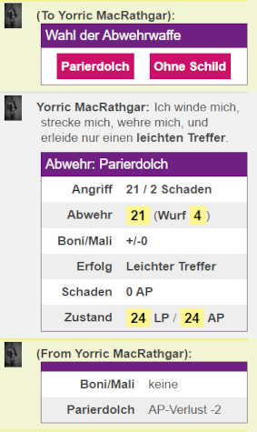
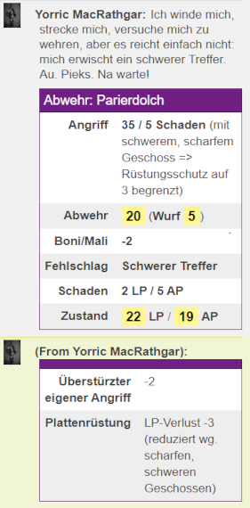

# MMM-Abwehrskript für Midgard (5. Ausgabe)

Aktuelle Version: **1.13.0 vom 2022-01-27,** erfordert MMM 1.26.0+.

Das MMM-basierte Midgard-Abwehrskript führt die Abwehr von Angriffen durch, deren Daten automatisch von den Angriffsskripten übernommen werden oder, falls nicht auffindbar, manuell eingegeben werden müssen. Die üblichen Regeln werden automatisch angewendet. Optional lassen sich in einem kurzen Konfigurationsskript die Auswahl der Abwehrwaffe (Schild/Parierwaffe) und die Textausgaben anpassen. Hier kann auch der Zugriff auf AP- und LP-Attribute für generische NPCs (die nur als Tokens individuell sind) angepasst werden. Gewonnene Praxispunkte für Schilde oder Parierwaffen werden ggf. automatisch im Charakterbogen gespeichert.

### Inhalt

- [Features & Anwendung](#features--anwendung)
- [Todo-Liste](#todo-liste)
- [Beispiel-Konfiguration](#beispiel-konfiguration)
- [What's new?](#changelog)


## Features & Anwendung

Das Skript liest entweder die Daten eines aktuellen Angriffs auf den Bezugstoken automatisch ein oder gibt einen Prompt aus, der den Benutzer zum Skript `defenseDataEntry` schickt, um alle wichtigen [Daten über den Angriff](#datenabfragen) zu erhalten. Daraus berechnet und erwürfelt das Skript die Ergebnisse des Abwehrversuchs und gibt sie aus. Ein Aufruf muss sich auf genau eine Abwehrtechnik (Standardwaffe/waffenlos/eine bestimmte Abwehrwaffe) beziehen. All diese Optionen können per [Konfigskripts](#konfig-skript-optional) gesetzt werden, das Abwehrskript funktioniert aber auch ohne Konfigskript und wendet dann die Standardabwehrtechnik des Charakterbogens an.

### Konfig-Skript (optional)

#### Unterschiedliche Abwehrwaffen

Wer nicht nur "Abwehr ohne Schild" kann und mehr als eine Abwehrfertigkeit nutzt, muss das Konfigskript benutzen und zumindest die Zeile `!mmm set cWeaponLabel = "Kleiner Schild"` mit dem Namen der benutzten Abwehrwaffe aus dem Abwehrblock des Kampfblatts setzen. Hierdurch erhält das Skript Zugriff auf die nötigen Fähigkeitswerte und Schadensmodifikatoren. Wer unterschiedliche Abwehrwaffen/Schilde nutzt, muss mehrere Konfigskripte anlegen und jeweils das gewünschte aufrufen (z.B. per Chatmenü, wie rechts im Screenshot oben abgebildet). Findet das Skript nur eine Abwehrfertigkeit, wird diese genutzt. Gibt es mehrere, von denen eine "Abwehr ohne Schild" heißt, wird diese genutzt. Vorgaben per Konfigskript haben aber natürlich Priorität.

Unterschiedliche Rüstungen werden demgegenüber so behandelt, wie im Charakterblatt: es zählt die Rüstung, die gerade als "getragen" markiert ist.

#### Unterschiedliche Charaktere/NPCs

Wer das Skript z.B. als Spielleiter nicht immer für den Charakter aufruft, der als Absender im Chatfenster steht, kann das jeweilige Bezugstoken anklicken; erkennt das Skript ein ausgewähltes Token, dann nutzt es dieses als Bezug. Für Spieler bietet sich demgegenüber an, pro Charakter das Konfigskript jeweils als Ability anzulegen und darin `!mmm set cOwnID = "@{character_id}"` zu setzen. Damit wird der Bezugscharakter jeweils fest gesetzt, egal wer gerade im Chat als Absender steht und welches Token angeklickt ist.

#### Geschichtenerzählerausgabe

`cVerbose = [true|false]` schaltet die Geschichtenerzählerausgabe an/ab. Nur wer `cVerbose = true` setzt, braucht sich über die `!mmm translate [...]: ...`-Zeilen Gedanken zu machen.

Die letzte Zeile ruft das eigentliche Skript auf, das muss dann unter dem hier genannten Namen angelegt sein (entweder beim Charakter oder beim GM).




### Datenabfragen

Das Skript bekommt die Eckdaten das Angriffs intern übergeben und fragt nur noch Abwehrmodifikatoren ab:
- *Standard-Abwehrmodifikatoren:*
  -  keine: *Normale Abwehr +/-0*
  - *Konzentrierte Abwehr +4*
  - *Ich greife überstürzt an -2*
  - *Ich bin überrascht -4*
- *Weitere spezielle Abwehrmodifikatoren:* Zahlenwert, nach Bedarf.

## Todo-Liste

- Sobald MMM Zugriff und Verarbeitung von Tabellen erlaubt, könnte das Skript alle verfügbaren Abwehrwaffen und Schilde zur Auswahl anbieten.
- Es gibt noch zwei Sonderfälle für [Abwehrmodifikatoren](https://midgard.alienn.net/doku.php?id=abwehr_nahkampf_boni_und_malusse), die -- samt der dann notwendigen Verschachtelung unterschiedlicher Kombinationen -- noch nicht eingebaut sind (schwere Beinverletzung und vollständige Dunkelheit).

## Beispiel-Konfiguration

Beispiel für einen Parierdolch, ohne die Erzählerei zu verändern (Voraussetzung ist, dass das Hauptskript als Makro `defend` angelegt ist, bzw. der Name des Makros in der letzten Zeile angepasst wird -- Aufruf mit # für Makros, % für Abilities):

```javascript
!mmm customize
!mmm    set cVerbose = true
!mmm    set cWeaponLabel = "Parierdolch"
!mmm    set cOwnID = "@{token_id}"
!mmm end customize
#defense
```

## Changelog

1.13.0 2022-01-27

- Praxispunkte werden nun automatisch gespeichert und geloggt

(...)

1.7.1 2021-12-20

- Bugfix: Kritische Treffer werden wieder korrekt erkannt

1.7.0 2021-12-19

- Parierwaffen und Schilde werden automatisch auf Anwendbarkeit gegenüber der Angriffswaffe überprüft

1.6.0 2021-12-18

- Stiller Spielleiter-Modus ganz ohne Ausgaben und 3D-Würfel
- Chatausgaben erscheinen nun im Namen des handelnden Tokens, auch bei NPCs

1.5.0 2021-12-13

- Automatische Datenübernahme aus den `m3mgd_*`-Attributen eines Dummy-Charakterblattes, das als Datenverschiebebahnhof genutzt wird
- Erfahrungspunkte aus jedem Angriff werden automatisch berechnet und gutgeschrieben
- (Workaround) Wird das Skript von einem Benutzer aufgerufen, dem kein Charakter zugeordnet ist, gibt es den Namen des handelnden Tokens eingangs aus.
- Geisterwesen (unendliche LP) und Untote (unendliche AP) werden nun korrekt behandelt
- Ausgabe: Tokenmarker für Erschöpfung, (schwere) Verletzungen und Tod in der Chat-Ausgabe ergänzt (als eine Art Legende für den Token)
- Bugfix: normale schwere Treffer werden nicht mehr fälschlich als schwere kritische Treffer ausgegeben
- Bugfix: Datenübersichten für NPCs werden nur noch dem Spielleiter geflüstert

1.4.0 2021-07-08

- Auch für generische NPCs nutzbar (erfordert MMM 1.20.0)

1.3.1 2021-04-27

- Modifikatoren-Log als Tooltip ergänzt

1.3.0 2021-04-18

- Visuelle Effekte für leichte, schwere und kritische Treffer ergänzt (erfordert MMM 1.17.0)

1.2.1 2021-04-14

- #2: Integration des animierten Würfels für den Abwehrwurf (eleganter als in 1.2)

1.1.1 2021-03-29

- Bugfix: Angriffsschaden = 0 wird nicht mehr abgefangen.

1.1 2021-03-14

- Modifikatoren der LP/AP-Verluste (Rüstung, Parierwaffen) werden jetzt auch privat an GM & Spieler dokumentiert
- Bugfix: Fehlende Tooltips für gute AP/LP-Level ergänzt
- Bugfix: Überstürzten eigenen Angriff (-2) ins modifierLog ergänzt
- Bugfix: Prüfung des Zugriffs auf den Charakterbogen verbessert
- Bugfix: Vorzeichenfehler/Die AP-Vorteile von Parierwaffen und Schilden sind als Minuszahlen gespeichert
- Bugfix: Variablennotation der customizable chat-Zeilen repariert

1.0 2021-03-13

- Bezeichnung und Schutzwert der getragenen Rüstung werden nun automatisch aus dem Charakterbogen gezogen
- Konzentrierte Abwehr (+4) und überraschender Angriff (-4) können ausgewählt werden
- Statusmarker für alle schweren Verletzungen, samt Erinnerung an die Konsequenzen, GIFs für die Todeszone
- Sonderfall abgefangen: "in der Todeszone gelingt eine Abwehr" -> Status bleibt schwerstverwundet ohne Countdown
- Abwehrwaffen eingebaut, samt PP-Chance + nur bei AP>0
- Lokalisierung eingebaut
- Bugfix: Vorzeichenfehler bei der Berechnung der Zeit bis zum Tod
- Bugfix: Angriffe mit 0 Schaden müssen nicht ausgespielt werden
- Bugfix: neue Verwundungen mit effektivem LP-Schaden 0 wegen Rüstung lösen keinen neuen Todescountdown mehr aus
- Intern: konfigurierbare Variablen umbenannt
