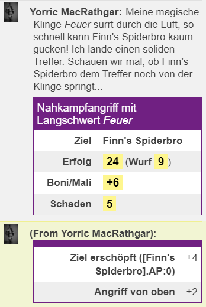

# MMM-Angriffsskript (Nahkampf) für Midgard (5. Ausgabe)

Aktuelle Version: **1.7.3 vom 2021-03-27,** erfordert MMM 1.16.0+.

Aufruf: 
- Hauptspiel ("Midgard"): ``#melee`` 
- Testspiel ("TEST"): ``#mmmMeleeAttack``

Das MMM-basierte Midgard-Nahkampfskript wickelt Nahkampfangriffe ab und muss pro Waffe konfiguriert werden. Dabei werden viele häufig benötigte Umstände wie die eigene Erschöpfung und die des Gegners (-4 bzw. +4 bei AP:0) automatisch und weitere Modifikatoren nach Benutzereingabe berücksichtigt. Alle angewandten Boni und Mali werden summarisch mit den Ergebnissen des Angriffs (Erfolg/Misserfolg, ggf. Schadenswurf) im Chat ausgegeben sowie im Detail an Spieler und GM geflüstert.

### Inhalt

- [Features & Anwendung](#features--anwendung)
- [Todo-Liste](#todo-liste)
- [Beispiel-Konfiguration](#beispiel-konfiguration)
- [What's new?](#changelog)


## Features & Anwendung

Das Skript fragt zunächst alle wichtigen Umstände vom Benutzer ab, berechnet die Ergebnisse des Angriffsversuchs und gibt sie aus. Ein Aufruf muss sich auf genau eine Angriffswaffe beziehen. Wer zwischen mehreren Waffen wechselt, benutzt am besten pro Waffe ein [Konfigskript](#konfig-skript-optional). Wird kein Konfigskript genutzt, versucht das Skript mit einem Kurzschwert anzugreifen; hat der angreifende Charakter keins, scheitert der Angriff schon daran.




### Konfig-Skript (notwendig)

#### Unterschiedliche Waffen und Waffenfähigkeiten

Mindestens muss ein Konfig-Skript eine der vom Charakter geführten Waffen deklarieren, d.h. die Variable ''cWeaponLabel'' so setzen, dass der Wert exakt der Bezeichnung im Kampfblatt entspricht, z.B. so: `!mmm set cWeaponLabel = "Langschwert"`. Hierdurch erhält das Skript Zugriff auf die nötigen Fähigkeitswerte und Schadensmodifikatoren. Wer unterschiedliche Waffen nutzt, muss mehrere Konfigskripte anlegen und jeweils das gewünschte aufrufen (z.B. per Chatmenü, oben im Screenshot abgebildet).

*Optional* können im Konfig-Skript für **benannte Waffen** (z.B. Erbstücke, magische Waffen) auch ein Name (''cWeaponName'') und eine getrennte Gattungsbezeichnung (''cWeaponType'') definiert werden. Diese werden nur zur Formulierung der Ausgabe benutzt, sie beziehen sich also nicht auf den Charakterbogen.

*Optional* werden als Spezialfall magischer Waffen auch **aktivierbare magische Waffen** unterstützt, die im aktivierten Zustand zusätzlichen und ggf. besonderen Schaden anrichten: 
```javascript
!mmm customize
(...)
!mmm set cWeaponMagic = [true|false]
!mmm set cWeaponMagicMarker = "[MMM-Token-Marker*]" 
!mmm set cWeaponMagicDamage = "[Würfelwurf, z.B. 1d+1]"
(...)
```
*) "MMM-Token-Marker" bezieht sich auf einen gültigen Namen für einen Roll20-Token-Marker in der [MMM-Notation](https://github.com/michael-buschbeck/mychs-macro-magic#attributes), wie z.B. ''status_all_for_one''.

#### Unterschiedliche Charaktere/NPCs

Wer das Skript z.B. als Spielleiter nicht immer für den Charakter aufruft, der als Absender im Chatfenster steht, kann für seine Charaktere das Konfigskript jeweils als Ability anlegen und darin `!mmm set cOwnID = "@{character_id}"` setzen. Damit wird der Bezugscharakter jeweils korrekt gesetzt, egal wer gerade im Chat als Absender steht.

#### Geschichtenerzählerausgabe

`cVerbose = [true|false]` schaltet die Geschichtenerzählerausgabe an/ab. Nur wer `cVerbose = true` setzt, braucht sich über die `!mmm translate [...]: ...`-Zeilen Gedanken zu machen.

`!mmm translate [Attack...]:` Diese Zeilen definieren die unterschiedlichen Teile und Fälle der Angriffserzählung, die im Chat ausgegeben wird. Alle `translate`-Zeilen sind optional, denn es gibt für jedes Element auch eine halbwegs sinnvolle Default-Ausgabe. Welche Variablen in jeder Zeile zur Verfügung stehen, erfährt man am besten mit folgendem Kommando im Roll20-Chat:
```javascript
!mmm customize export to [Name des Makros, das angelegt werden soll, z.B. meleeConfigSample]
#[Name des Angriffsskripts im Spiel, z.B. melee]
```

Weitere `translate`-Zeilen gibt es für "In-Game-Fehler", also technisch korrekte Angriffe auf Ziele, die z.B. zu weit entfernt sind.

Spezialfall für magische Waffen mit Zusatzschaden: die Zeile `AttackOpeningMagicDamage` wird beim Einsatz aktivierter magischer Waffen **statt** der normalen Startzeile ausgegeben. 

Die letzte Zeile `#melee` ruft das eigentliche Skript auf, das muss dann unter dem hier genannten Namen angelegt sein (entweder beim Charakter oder beim GM).

### Datenabfragen

Das Skript fragt bei jedem Start eine Reihe von Daten zum Angriff ab, ob relevant oder nicht:
- *Standard-Abwehrmodifikatoren* werden in einem Baum abgefragt, der z.B. die Kombination von *spontan* (-4) oder *überstürzt* (-6) mit *wehrloses Ziel* (+4) oder *Angriff von oben* (+2) ermöglicht.
- *Weitere spezielle Abwehrmodifikatoren:* Zahlenwert, nach Bedarf -- hier kann alles ergänzt werden, was der automatische Baum nicht bietet oder was der GM ändern möchte.
- **Nicht abgefragt** wird die Position des Angreifers zum Gegner. Ob ein *Angriff von hinten* erfolgt, berechnet das Skript automatisch.


## Todo-Liste

- Sobald MMM Zugriff und Verarbeitung von Tabellen erlaubt, könnte das Skript alle verfügbaren Angriffswaffen zur Auswahl anbieten und, falls nur eine vorhanden ist, als Default komplett auf die Definition in einem Konfigurationsskript verzichten.
- An waffenlose Kampftechniken und Handgemenge anpassen. Zurückdrängen und ähnliche Manöver einbauen.
- Gezielte Angriffe auf Körperteile einbauen.
- Kritische Fehler-/Erfolgsereignisse automatisch auswürfeln, ausgeben und soweit wie möglich umsetzen.


## Beispiel-Konfiguration

Minimalbeispiel für ein Kurzschwert, ohne die Erzählerei zu verändern (Voraussetzung ist, dass das Hauptskript als Makro `melee` angelegt ist, bzw. der Name des Makros in der letzten Zeile angepasst wird -- Aufruf mit # für Makros, % für Abilities):

```javascript
!mmm customize
!mmm    set cVerbose = true
!mmm    set cWeaponLabel = "Kurzschwert"
!mmm    set cWeaponName = ""
!mmm    set cWeaponType = "Kurzschwert"
!mmm end customize
#melee
```

## Changelog

1.7.3 2021-04-27 (requires MMM 1.16.0+)
- Modifikatoren-Log als Tooltip ergänzt
- Anpassbarkeit der Tabellenausgabe entfernt
- Unicode-Emojis für Erschöpfung ergänzt

1.7.0 2021-04-25 (requires MMM 1.16.0+)

- 3D-Würfel für den Erfolgswurf
- Intern: MMM-Versionscheck beim Start

1.6.0 2021-03-27 (requires MMM 1.16.0+)

- Sonderfunktion magischer Zusatzschaden aufgeräumt: ES FÄLLT WEG: cWeaponMagic, magische Waffen werden nun automatisch aus dem Charakterbogen erkannt. INKOMPATIBEL: cWeaponMagicMarker & cWeaponMagicDamage sowie die Chat-Zeile AttackOpeningMagicDamage fallen auch weg, neu dafür: cMagicExtraDamageMarker, cMagicExtraDamage, cMagicExtraDamageLabel sowie die Chat-Zeilen AttackOpeningExtraMagicDamage und AttackSuccessClosingExtraMagicDamage
- Dropdown-Modifikatoren werden nun einzeln dokumentiert, und weitere Kombinationen ergänzt
- Verbose=true: Schwere des Schadens wird nun verbal dargestellt, Nullschaden wie eine 1 beim Schadenswurf.

1.5.1 2021-03-25

-  Abstände werden nun zwischen Tokenrändern berechnet (statt zwischen Mittelpunkten; erfordert MMM 1.16.0 oder höher)
-  Erfolg/Fehlschlag des Angriffs ist nun auf den ersten Blick in der Tabelle ersichtlich (zweite Zeile)
-  Magischer Sonderschaden wird nur bei erfolgreichen Angriffen an GM und Spieler ausgegeben
-  Cleanup: Fehler "WeaponNotFound" wird nicht mehr als Spielausgabe sondern als Konfigurationsfehler behandelt

1.5.0 2021-03-14

-  Ausgabe und Code für Schadensbestandteile optimiert
-  Zugriffsverweigerung auf Ziele wird nun korrekt abgefangen (erfordert MMM 1.15.0+)
-  Fehler-Chatzeilen OutsideFieldOfVision, OutsideStrikeDistance: Zusätzliche Daten übergeben
-  Verbose-Chatzeilen geben weniger Daten aus, damit die Default-Ausgabe lesbarer ist
-  Optional: Funktionalität für aktivierungsabhängigen magischen Zusatzschaden ergänzt
-  Bugfix: Wenn die Waffe keinen Namen hat, wird ein sinnvolles Label ausgegeben
-  Bugfix: Negative Schadensergebnisse auf 0 normalisiert
-  Bugfix: Prüfung des Zugriffs auf den Charakterbogen verbessert

