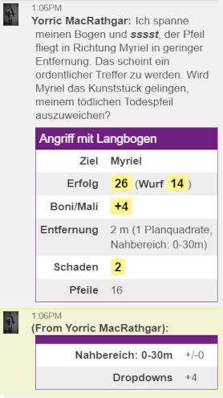

# MMM-Angriffsskript (Fernkampf) für Midgard (5. Ausgabe)

Aktuelle Version: **1.8.3 vom 2021-04-27,** erfordert MMM 1.16.0+.

Aufruf: 
- Hauptspiel ("Midgard"): ``#RangeAttack`` 
- Testspiel ("TEST"): ``#mmmRangedAttack``

Das MMM-basierte Midgard-Fernkampfskript wickelt Fernkampfangriffe ab und muss pro Waffe konfiguriert werden. Dabei werden viele häufig benötigte Umstände wie die eigene Erschöpfung und die des Gegners (-4 bzw. +4 bei AP:0) automatisch und weitere Modifikatoren nach Benutzereingabe berücksichtigt. Alle angewandten Boni und Mali werden summarisch mit den Ergebnissen des Angriffs (Erfolg/Misserfolg, ggf. Schadenswurf) im Chat ausgegeben sowie im Detail an Spieler und GM geflüstert.

### Inhalt

- [Features & Anwendung](#features--anwendung)
- [Todo-Liste](#todo-liste)
- [Beispiel-Konfiguration](#beispiel-konfiguration)
- [What's new?](#changelog)


## Features & Anwendung

Das Skript fragt zunächst alle wichtigen Umstände vom Benutzer ab, berechnet die Ergebnisse des Angriffsversuchs und gibt sie aus. Ein Aufruf muss sich auf genau eine Angriffswaffe beziehen. Wer zwischen mehreren Waffen wechselt, benutzt am besten pro Waffe ein [Konfigskript](#konfig-skript-optional). Wird kein Konfigskript genutzt, versucht das Skript mit einem Kurzschwert anzugreifen; hat der angreifende Charakter keins, scheitert der Angriff schon daran.




### Konfig-Skript (notwendig)

#### Unterschiedliche Waffen, Waffenfähigkeiten und Munitionstypen

Mindestens muss ein Konfig-Skript eine der vom Charakter geführten Waffen deklarieren, d.h. die Variable ''cWeaponLabel'' so setzen, dass der Wert exakt der Bezeichnung im Kampfblatt entspricht, z.B. so: `!mmm set cWeaponLabel = "Langbogen"`. Hierdurch erhält das Skript Zugriff auf die nötigen Fähigkeitswerte und Schadensmodifikatoren. Wer unterschiedliche Waffen nutzt, muss mehrere Konfigskripte anlegen und jeweils das gewünschte aufrufen (z.B. per Chatmenü, oben im Screenshot abgebildet).

*Optional* können im Konfig-Skript für **benannte Waffen** (z.B. Erbstücke, magische Waffen) auch ein Name (''cWeaponName'') und eine getrennte Gattungsbezeichnung (''cWeaponType'') definiert werden. Diese werden nur zur Formulierung der Ausgabe benutzt, sie beziehen sich also nicht auf den Charakterbogen.

**Notwendig** sind für jede Fernkampfwaffe die Variablen ''cRangeUpperBoundClose'', ''cRangeUpperBoundMid'' und ''cRangeUpperBoundFar''. Sie geben die Obergrenzen des jeweiligen Entfernungsbereichs in Metern an.

**Notwendig** ist weiterhin ''cAmmoLabel'', die Bezeichnung der Munition, die exakt dem Namen des Attributs im Charakterbogen entsprechen muss, in der die aktuelle und die Maximalanzahl der Munition steht, z.B. `set cAmmoLabel = "Pfeile"`.

*Optional* ist ''cAmmoWarnThreshold'' (Dezimalzahl wie `0.25`): ab diesem Anteil des Munitionsmaximums wird vor Munitionsmangel gewarnt.

*Optional* für Charaktere, die **magische Munition** benutzen: Wer z.B. magische Pfeile besitzt, die zusätzlichen Schaden verursachen, kann eine Kopie des Konfigskripts anlegen (zwecks fallweiser Auswahl, welche Pfeile benutzt werden sollen) und in der Version für die magische Munition zusätzlich folgende Variablen & die unten erwähnten zusätzlichen Ausgabezeilen (für `verbose=true`) setzen:
- `cAmmoMagic = [true|false]` (Default: ''false'', ''true'' wenn magische Munition benutzt werden soll)
- `cAmmoMagicLabel` (wie ''cAmmoLabel'', Bezeichnung der Munition und des Attributs im Charakterbogen)
- `cAmmoMagicSkillBonus` (Bonus/Malus für den Angriffswurf, numerisch)
- `cAmmoMagicDamage` (Roll20-Würfelformel, z.B. "1d6+1" oder einfach "+1", in Anführungszeichen)

#### Unterschiedliche Charaktere/NPCs

Wer das Skript z.B. als Spielleiter nicht immer für den Charakter aufruft, der als Absender im Chatfenster steht, kann für seine Charaktere das Konfigskript jeweils als Ability anlegen und darin `!mmm set cOwnID = "@{character_id}"` setzen. Damit wird der Bezugscharakter jeweils korrekt gesetzt, egal wer gerade im Chat als Absender steht.

#### Geschichtenerzählerausgabe

`cVerbose = [true|false]` schaltet die Geschichtenerzählerausgabe an/ab. Nur wer `cVerbose = true` setzt, braucht sich über die `!mmm translate [...]: ...`-Zeilen Gedanken zu machen.

`!mmm translate [Attack...]:` Diese Zeilen definieren die unterschiedlichen Teile und Fälle der Angriffserzählung, die im Chat ausgegeben wird. Alle `translate`-Zeilen sind optional, denn es gibt für jedes Element auch eine halbwegs sinnvolle Default-Ausgabe. Welche Variablen in jeder Zeile zur Verfügung stehen, erfährt man am besten mit folgendem Kommando im Roll20-Chat:
```javascript
!mmm customize export to [Name des Makros, das angelegt werden soll, z.B. rangedAttackConfigSample]
#[Name des Angriffsskripts im Spiel, z.B. RangedAttack]
```

Weitere `translate`-Zeilen gibt es für "In-Game-Fehler", also technisch korrekte Angriffe auf Ziele, die z.B. zu weit entfernt sind.

Spezialfall für magische Munition: die Zeilen `AttackOpeningMagicDamage` und `AttackSuccessClosingMagic` werden beim Einsatz magischer Munition **statt** der normalen Start- und Schlusszeilen ausgegeben. Hier könnt ihr was Tolles erzählen oder mit einem GIF die besonderen Effekte der magischen Munition rüberbringen. 

Die letzte Zeile `#RangeAttack` ruft das eigentliche Skript auf, das muss dann unter dem hier genannten Namen angelegt sein (entweder beim Charakter oder beim GM).

### Datenabfragen

Das Skript fragt bei jedem Start neben dem Ziel des Angriffs (auf gegnerisches Token klicken) eine Reihe von Daten zum Angriff ab, ob relevant oder nicht:
- *Standard-Abwehrmodifikatoren* werden in einem Baum abgefragt, der z.B. die Kombination von *spontan* (-4) oder *sorgfältig gezielt* (+4) mit *wehrloses Ziel* (+4) oder unterschiedlichen Größen des Ziels (-4..+4) ermöglicht.
- *Weitere spezielle Abwehrmodifikatoren:* Zahlenwert, nach Bedarf -- hier kann alles ergänzt werden, was der automatische Baum nicht bietet oder was der GM ändern möchte.
- **Nicht abgefragt** wird die Position und Entfernung des Angreifers zum Gegner. Ob ein *Angriff von hinten* erfolgt und ob die Reichweite der Waffe ausreicht, berechnet das Skript automatisch.


## Todo-Liste

- Sobald MMM Zugriff und Verarbeitung von Tabellen erlaubt, könnte das Skript alle verfügbaren Angriffswaffen zur Auswahl anbieten und, falls nur eine vorhanden ist, als Default komplett auf die Definition in einem Konfigurationsskript verzichten.
- Lassen sich die Effekte von Angriffen ins Handgemenge besser automatisieren? Erstmal +4 auf Ziel im Handgemenge, aber es muss dann automatisch bestimmt werden, welche der Parteien im Handgemenge zufällig getroffen wurde. Lohnt das?
- Gezielte Angriffe auf Körperteile / Scharfschießen
- Kritische Fehler-/Erfolgsereignisse automatisch auswürfeln, ausgeben und soweit wie möglich umsetzen.


## Beispiel-Konfiguration

Minimalbeispiel für ein Wurfmesser, ohne die Erzählerei zu verändern (Voraussetzung ist, dass das Hauptskript als Makro `RangeAttack` angelegt ist, bzw. der Name des Makros in der letzten Zeile angepasst wird -- Aufruf mit # für Makros, % für Abilities):

```javascript
!mmm customize
!mmm    set cWeaponLabel = "Wurfmesser"
!mmm    set cRangeUpperBoundClose = 10
!mmm    set cRangeUpperBoundMid = 15
!mmm    set cRangeUpperBoundFar = 20
!mmm    set cAmmoLabel = "Wurfmesser"
!mmm end customize
#melee
```

## Changelog

1.8.3 2021-04-27 (requires MMM 1.16.0 or higher)
- Modifikatoren-Log als Tooltip ergänzt
- Anpassbarkeit der Tabellenausgabe entfernt
- Unicode-Emojis für Erschöpfung ergänzt

1.8.0 2021-04-25 (requires MMM 1.16.0+)

- 3D-Würfel für den Erfolgswurf
- Intern: MMM-Versionscheck beim Start

1.7.0 2021-03-27

- Abstände werden nun zwischen Tokenrändern berechnet (statt zwischen Mittelpunkten; erfordert MMM 1.16.0 oder höher)
-  Optionale magische Munition mit Angriffsbonus und Zusatzschaden kann nun genutzt werden
-  Bugfix: negativer Schaden wird abgefangen

1.6beta 2021-03-14

-  MMM-Lokalisierung eingebaut
-  Senderunabhängigen Zugriff auf den angreifenden Charakter portiert
-  Bei kritischen Erfolgen gibt es den bestellten "BLING BLING Whisper" an GM und User 
-  Notation der Tooltips, Ausgabe der Schadensbestandteile ordentlicher (wie im Nahkampfskript)
-  Wenn die Default- oder konfigurierte Waffe nicht im Charakterbogen ist => Abbruch.
-  Zugriffsverweigerung auf Ziele wird nun korrekt abgefangen (erfordert MMM 1.15.0)
-  Intern: Präfixe für konfigurierbare Variablen eingeführt ("cFooBar")
-  Bugfix: Prüfung des Zugriffs auf den Charakterbogen verbessert
